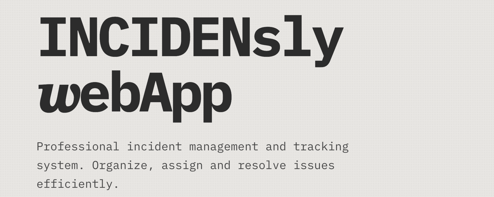
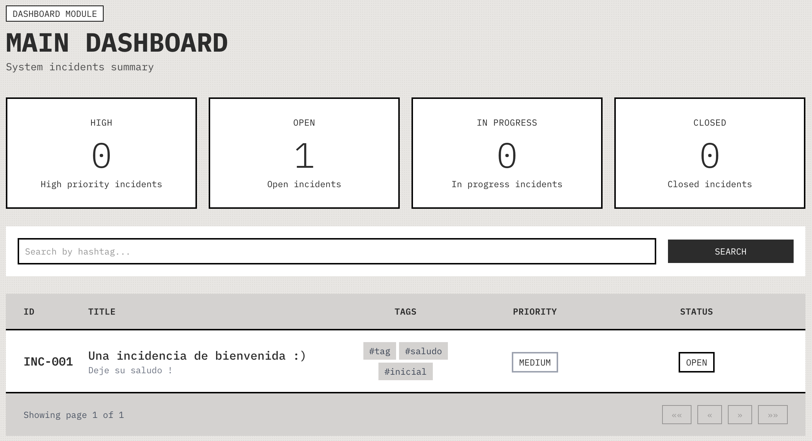
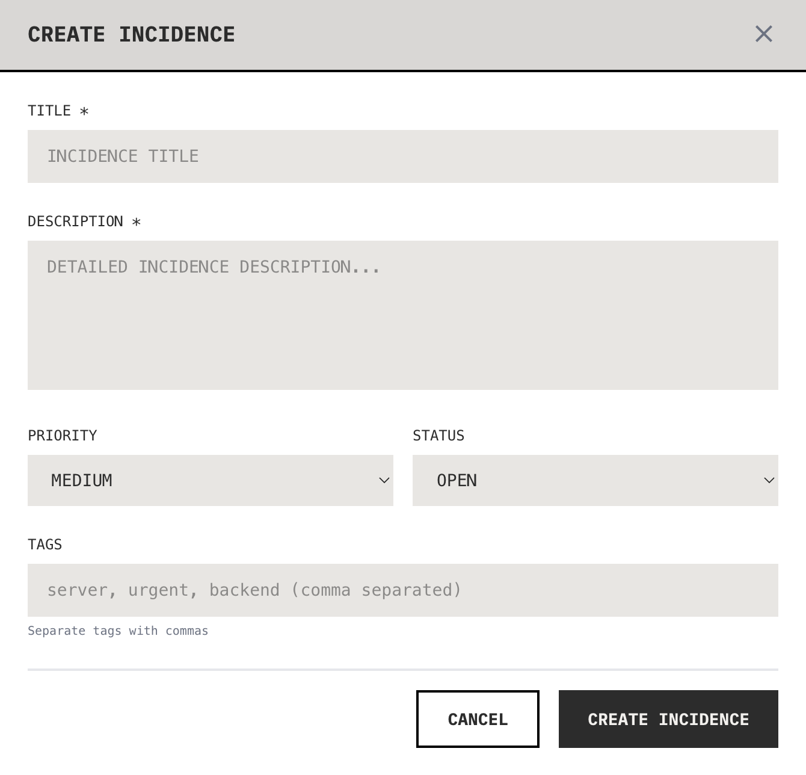
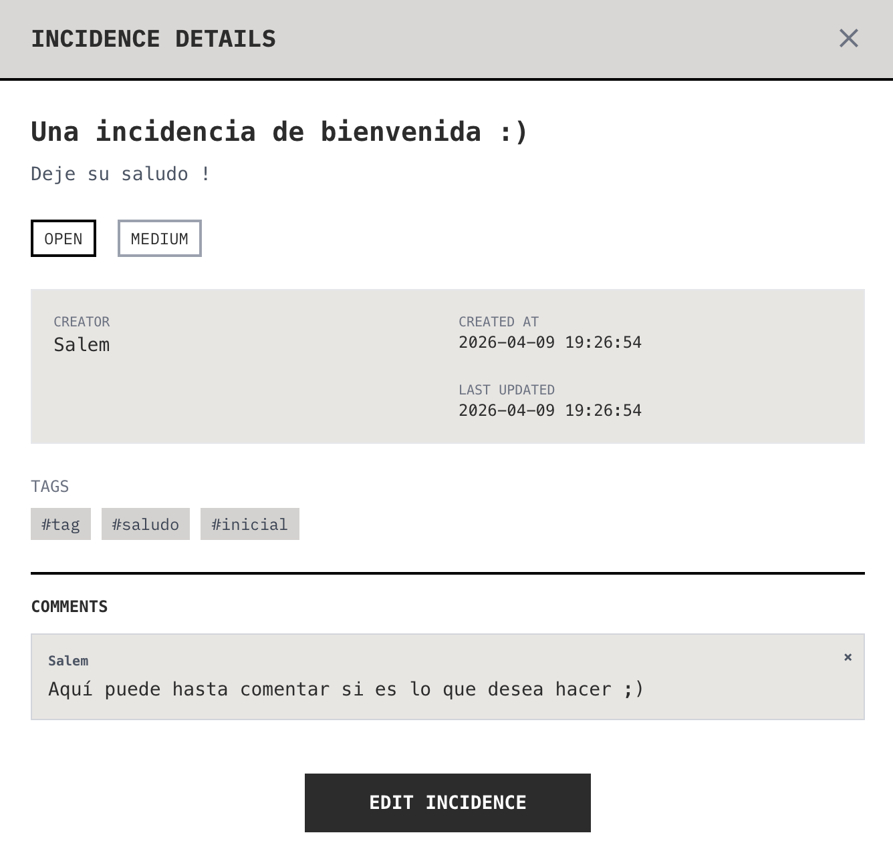

A professional incident management system built with React and Tailwind CSS, featuring a  "Tactile Data-Sheet" design aesthetic.

## **[Try me here ! ✌︎](https://incidenslywebapp.vercel.app)**

---

## Table of Contents

- [Overview](#overview)
- [Features](#features)
- [Tech Stack](#tech-stack)
- [Getting Started](#getting-started)
- [Environment Variables](#environment-variables)
- [API Integration](#api-integration)
- [Design System](#design-system)
- [Authentication](#authentication)
- [Components](#components)
- [Dockerization](#dockerization)
- [Pages](#pages)
- [Future Enhancements](#future-enhancements)
- [Related Projects](#related-projects)

---

## Overview

INCIDENsly 𝒘ebApp is a React-based frontend application for managing technical incidents. It provides a comprehensive interface for creating, tracking, and resolving incidents with support for user roles, comments, tags, and real-time statistics.

The application communicates with a Laravel REST API backend (`S5_API_REST`) and implements token-based authentication with automatic request interceptors.

---

## Features

### Core Functionality

- **Incident Management** — Create, view, edit, and delete incidents with priority levels and status tracking
- **User Authentication** — Secure login/registration with JWT token persistence
- **Role-Based Access** — Admin panel for user management (admin-only)
- **Comments System** — Add and manage comments on incidents
- **Tagging System** — Categorize incidents with custom tags
- **Dashboard Statistics** — Real-time metrics showing incident distribution by priority and status

### User Interface

- **Landing Page** — Public page with feature showcase
- **Dashboard** — Interactive overview with filter buttons and tag search
- **My Incidences** — Personal incident list with pagination
- **Admin Area** — User management console for administrators to manage users.

### Technical Highlights

- **Protected Routes** — Automatic redirect for unauthenticated users
- **Token Interceptors** — Axios automatically injects authentication headers
- **State Management** — React Context for auth and incidences state
- **Responsive Design** — Mobile-friendly layout with grid-based components

---

## Tech Stack

| Category | Technology |
|----------|------------|
| **Framework** | React 19 + Vite 8 |
| **Styling** | Tailwind CSS v4 |
| **Routing** | React Router v7 |
| **HTTP Client** | Axios |
| **State** | React Context API |
| **Icons** | Material Symbols |
| **Fonts** | IBM Plex Mono |
| **Deployment** | Vercel |

---

## Getting Started

### Prerequisites

- Node.js 18+
- npm or yarn
- Backend API running ([API Repository](https://github.com/malmental/S5_API_REST))

### Installation

```bash
# Clone the repository
git clone https://github.com/malmental/S5_API_frontend.git
cd S5_API_frontend

# Install dependencies
npm install

# Start development server
npm run dev
```

The application will be available at `http://localhost:5173`

### Production Build

```bash
# Create optimized build
npm run build

# Preview production build
npm run preview
```

---

## Environment Variables

Create a `.env` file in the root directory:

```env
VITE_API_BASE_URL=https://incidensly-webapp-production.up.railway.app
```

| Variable | Description | Default |
|----------|-------------|---------|
| `VITE_API_BASE_URL` | Backend API base URL | `http://localhost:8000` |

> **Note:** During development, Vite proxies `/api` requests to `http://127.0.0.1:8000` automatically.

---

## API Integration

The frontend uses Axios with a pre-configured instance (`src/services/api.js`) that handles:

- **Base URL Configuration** — All requests prefixed with `/api/v1`
- **Authentication Headers** — Bearer token automatically injected via interceptor
- **Global Error Handling** — 401, 403, 500 errors handled centrally

---

## Design System

### "Tactile Data-Sheet"

A technical, grid-based aesthetic inspired by vintage data processing systems. 



### Color Palette

| Variable | Hex | Usage |
|----------|-----|-------|
| `surface` | `#e8e6e3` | Main background (cream) |
| `surface-dim` | `#d4d2cf` | Dimmed surfaces |
| `primary` | `#2c2c2c` | Primary (soft black) |
| `on-primary` | `#f2f0ed` | Text on primary |
| `error` | `#ba1a1a` | Error states |
| `on-surface` | `#2c2c2c` | Primary text |



### Typography

- **Font Family:** IBM Plex Mono (monospace throughout)
- **Headlines:** `font-sans`, bold
- **Body:** `font-mono`
- **Labels:** `font-label`, uppercase, small



### Design Elements

- **Zero border-radius** — Sharp, technical corners
- **2px borders** — Heavy, confident outlines
- **Stippled backgrounds** — Subtle dot pattern for depth
- **12-column grids** — Structured, organized layouts

---

## Authentication

### Flow

1. User submits credentials to `/login`
2. Backend validates and returns `{ token: "..." }`
3. Token stored in `localStorage` under key `'token'`
4. Axios interceptor attaches `Authorization: Bearer <token>` to all requests
5. On 401 response, token is cleared and user redirected to login

### Route Protection

| Route | Protection | Description |
|-------|------------|-------------|
| `/` | Public | Landing page |
| `/login` | Public | Login form |
| `/register` | Public | Registration form |
| `/dashboard` | Protected | Main dashboard |
| `/my-incidences` | Protected | User's incidents |
| `/admin` | Protected + Admin | User management |

---

## Components

### Layout Components

| Component | Description |
|-----------|-------------|
| `SideNavBar` | Fixed sidebar with navigation menu and user dropdown |
| `TopNavBar` | Fixed top bar with branding and user info |

### UI Components

| Component | Description |
|-----------|-------------|
| `Modal` | Reusable floating window with overlay and animations |
| `Pagination` | Page navigation with previous/next controls |
| `LogoutModal` | Logout confirmation dialog |

### Feature Components

| Component | Description |
|-----------|-------------|
| `IncidentsTable` | Interactive table with filtering and pagination |
| `IncidenceDetail` | Full incident view with comments section |
| `IncidenceForm` | Create/edit form with validation |
| `CreateIncidentFAB` | Floating action button for quick creation |

---

## Pages

| Page | Route | Auth | Description |
|------|-------|------|-------------|
| Landing | `/` | Public | Marketing homepage |
| Login | `/login` | Public | Authentication |
| Register | `/register` | Public | User registration |
| Dashboard | `/dashboard` | Protected | Overview & statistics |
| My Incidences | `/my-incidences` | Protected | Personal incidents |
| Admin | `/admin` | Protected + Admin | User management |
| Not Found | `*` | Public | 404 fallback |

---

## Dockerization

### Prerequisites
- Docker Desktop installed and running
Quick Start

### 1. Build and start the container
docker-compose up -d --build

### 2. Verify container is running
docker-compose ps

### 3. Open in browser
http://localhost:3000

### Stop
docker-compose down

### View Logs
docker-compose logs -f

**Note:** The backend API must be running at `http://localhost:8000` for full functionality (login/register).

---

## Future Enhancements

These are some few key point we would recommend to implement in the future to make the app more complete and robust:

### User Profile/Edit Profile Section
   - Edit own user data (name, email, password)
   - Avatar upload
   - Profile page with activity history

### Advanced Search & Filters
   - Search by text, date range, status, priority
   - Save filter presets
   - Export to CSV/Excel or any format for persistence docs.

### Comments & Activity Log
   - Activity timeline
   - @mention users

### User Management (Admin)
   - Assign roles or permissions system (admin, no-admin, guest)

### Notifications
   - In-app notifications for updates
   - Email notifications for critical incidents

### Dashboard Analytics
   - Charts or visual graphs for incident trends
   - KPIs and metrics
   - Export reports

### Tags & Categories
   - Categories for incidents
   - Bulk tagging (at the moment it has a max of 10 tags per incident)
    - Tag management interface

### File Attachments
   - Upload screenshots/documents
   - Image preview

### Mobile Responsive Improvements
   - Better mobile layout
   - Touch-friendly actions

### Audit Log (Admin)
   - Track all changes
   - Who created/updated/closed incidents

---

## Related Projects

- **[INCIDENsly API](https://github.com/malmental/S5_API_REST)** — Laravel REST API backend


